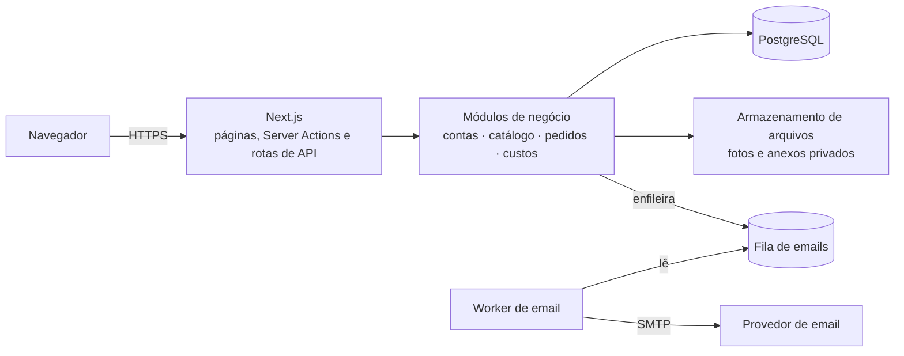

# Traço Studio — loja de impressão 3D (showcase)

> Apresentação pública do projeto. **O código-fonte é privado** e não está neste repositório.

Traço Studio (nome em desenvolvimento) é a loja online de dois sócios que fabricam e vendem peças impressas em 3D.
O site reúne em um só lugar o **catálogo de produtos prontos** e os **pedidos personalizados** — da ideia do cliente
até a aprovação do projeto e o aceite do orçamento —, com conversa privada entre cliente e equipe.

## O problema

Vender peças impressas em 3D sob medida costuma acontecer em conversas espalhadas por aplicativos de mensagem:
fotos de referência se perdem, medidas mudam sem registro, o cliente aprova "o modelo" sem saber se aprovou o preço
e a equipe recalcula custos à mão. O objetivo do projeto é organizar esse processo:

- o cliente navega no catálogo ou descreve a própria ideia, **sem precisar saber modelar**;
- tudo acontece dentro do site: conversa, anexos, versões do projeto, aprovação e orçamento;
- **aprovar o projeto, aceitar o orçamento e pagar são etapas separadas**, cada uma registrada;
- valores são calculados e conferidos no servidor, com histórico que não muda quando o catálogo muda.

## Telas

> Capturas do sistema rodando localmente, em ambiente de testes isolado, com **dados fictícios** (pessoas, pedidos e
> conversas inventados). As imagens dos produtos são **ilustrações geradas para a demonstração**, não fotos de peças reais.

| Página do produto | No celular |
|---|---|
|  |  |

**Busca tolerante a acentos e tema escuro opcional**

**"Faça você mesmo": pedido personalizado com fotos de referência e STL opcional**

**Acompanhamento do pedido: apresentação para aprovação e conversa com a equipe**

| Orçamento com calculadora interna (equipe) | Orçamento recebido pelo cliente |
|---|---|
|  |  |

**Depois do aceite: aguardando pagamento — sem cobrança simulada**

**Caixa de pedidos da equipe, com mensagens não lidas por pessoa**

## Funcionalidades implementadas

**Contas e permissões**
- Cadastro com confirmação de email (link de uso único), login, recuperação de senha e "sair de todos os dispositivos".
- Papéis de proprietário, administrador e cliente; acesso administrativo só por convite; permissões verificadas no
  servidor em toda operação; limite de tentativas de login.

**Catálogo**
- Produtos com categorias múltiplas, temas, cores, material e dimensões; rascunhos invisíveis ao público.
- Publicação exige pelo menos **4 fotos reais e distintas**; galeria convencional com ampliação e navegação por teclado.
- Busca sem acentos e tolerante a erros de digitação, filtros compartilháveis por link e "carregar mais".

**Pedidos do catálogo**
- Escolha de cor e quantidade, revisão autenticada e envio protegido contra pedido duplicado.
- O preço é conferido no servidor e o item fica registrado como estava no momento do pedido.
- Frete definido pela equipe; até lá o pedido mostra "aguardando definição", nunca um valor inventado.

**Pedidos personalizados**
- Descrição da ideia, finalidade, medidas, quantidade e preferências; fotos de referência e arquivo STL opcionais.
- Anexos privados: imagens reprocessadas sem metadados, STL validado como dado (nunca executado), acesso conferido a
  cada download.

**Conversa privada**
- Uma conversa por pedido, com anexos, identificação de quem respondeu (inclusive entre membros da equipe), horário,
  mensagens não lidas por pessoa, histórico paginado, atualização automática e reenvio sem duplicar.
- Avisos por email levam ao pedido na conta autenticada, sem expor o conteúdo da conversa.

**Apresentação e aprovação do projeto**
- A equipe envia imagens, medidas e especificações em versões numeradas.
- O cliente aprova ou pede ajustes; a aprovação vale só para aquela versão e uma nova versão exige nova aprovação.

**Orçamento e aceite**
- Orçamento versionado, com validade, frete e total; versões vencidas ou substituídas não podem ser aceitas.
- Calculadora interna de custos (filamento, energia, máquina, trabalho, reserva de falhas, margem sobre a venda) com
  parâmetros versionados — o cliente nunca vê custos internos; parâmetro ausente aparece como pendência, não como zero.
- Aceite registrado de forma idempotente. **Aceitar não é pagar**: o pedido passa a "aguardando pagamento" e a
  produção não começa automaticamente.

## Tecnologias

| Camada | Ferramentas |
|---|---|
| Aplicação | Next.js 16 (App Router), React 19, TypeScript 5.9 (modo estrito) |
| Interface | Tailwind CSS 4, fontes Bricolage Grotesque e Inter (licença OFL), tema claro e escuro |
| Dados | PostgreSQL 18 (busca com `pg_trgm` e `unaccent`), Prisma ORM 7 |
| Autenticação | Better Auth |
| Validação e valores | Zod 4, decimal.js (dinheiro em centavos inteiros) |
| Arquivos | sharp (reprocessamento de imagens), armazenamento em disco por adaptador |
| Email | fila no banco + worker com Nodemailer (SMTP); Mailpit para captura local |
| Testes | Vitest (unidade e integração com banco de testes isolado) e Playwright (Edge e WebKit) |

## Arquitetura

Monólito modular: as rotas só validam a entrada e chamam os módulos, onde ficam as regras (autorização, preços,
versões, idempotência). Operações críticas usam transações e travas no banco.

## Estado atual

| Item | Situação |
|---|---|
| Funcionalidades acima | Implementadas e funcionando em ambiente local |
| Testes automatizados | Unidade, integração (banco de testes isolado) e ponta a ponta no navegador, executados com sucesso na última rodada |
| Validação manual pelos sócios | Em andamento |
| Hospedagem e domínio | **Não publicados** — arquitetura e procedimento de implantação preparados, aguardando decisão |
| Email transacional real | **Não configurado** — hoje os emails são capturados localmente |
| Pagamento online | **Não implementado** — próxima etapa |

## Próximas etapas

1. Concluir a validação manual e ajustar o que aparecer.
2. Hospedagem, domínio e email transacional real, com verificação em ambiente publicado.
3. Integração com gateway de pagamento, com confirmação verificável pelo servidor.
4. Depois: carrinho e estoque, produção e prazos, envio e rastreio, avaliações.

## Autoria e uso de IA

**Kelvin Simoes** — concepção do produto, definição dos fluxos de compra, personalização, aprovação e orçamento,
regras de negócio e critérios de segurança, decisões de escopo e validação do funcionamento e do visual.

O desenvolvimento contou com **apoio de IA** (assistente de programação), usado para implementar código, testes e
documentação a partir das especificações, decisões e revisões feitas pelo autor. Todo o trabalho passou por
verificação com testes automatizados e validação manual.

## Código-fonte

O código-fonte da aplicação é **privado**. Este repositório contém apenas esta apresentação e as imagens de
demonstração; ele não disponibiliza o software nem concede licença de uso.
