# Traço Studio — loja de impressão 3D (showcase)

> Apresentação pública do projeto. **O código-fonte é privado** e não está neste repositório.

Traço Studio (nome em desenvolvimento) é a loja online de dois sócios que fabricam e vendem peças impressas em 3D.
O site reúne em um só lugar o **catálogo de produtos prontos**, os **pedidos personalizados** — da ideia do cliente
até a aprovação do projeto e o aceite do orçamento — e as **propostas de produtos enviadas por parceiros**, com
conversa privada entre cada pessoa e a equipe.

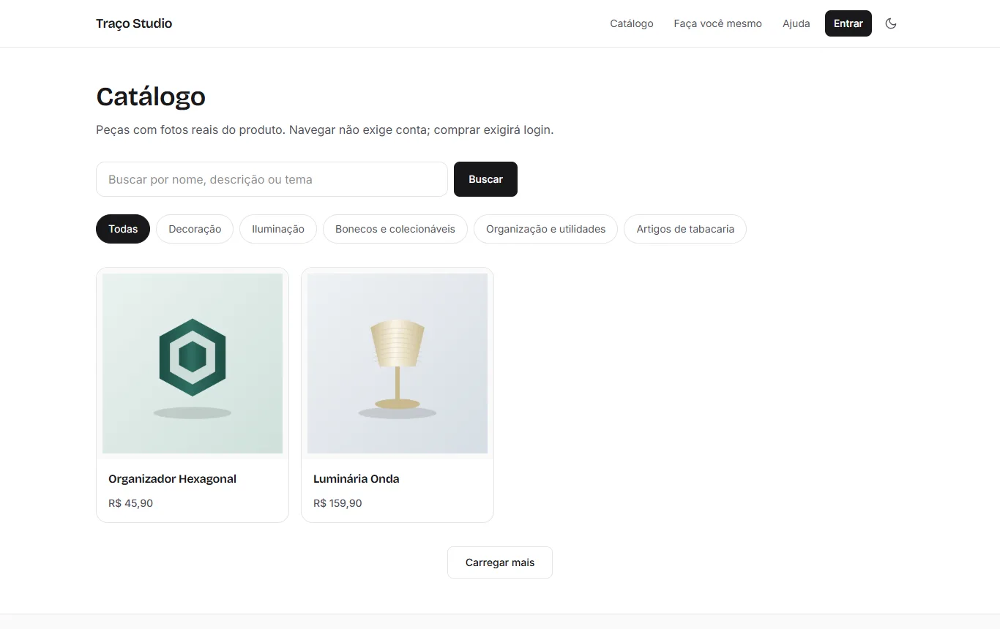

## O problema

Vender peças impressas em 3D sob medida costuma acontecer em conversas espalhadas por aplicativos de mensagem:
fotos de referência se perdem, medidas mudam sem registro, o cliente aprova "o modelo" sem saber se aprovou o preço
e a equipe recalcula custos à mão. O objetivo do projeto é organizar esse processo:

- o cliente navega no catálogo ou descreve a própria ideia, **sem precisar saber modelar**;
- tudo acontece dentro do site: conversa, anexos, versões do projeto, aprovação e orçamento;
- **aprovar o projeto, aceitar o orçamento e pagar são etapas separadas**, cada uma registrada;
- valores são calculados e conferidos no servidor, com histórico que não muda quando o catálogo muda.

## Telas

> Capturas do sistema rodando localmente, em ambiente de testes isolado, com **dados fictícios** (pessoas, pedidos,
> conversas e parâmetros de custo inventados; endereços de exemplo). As imagens dos produtos são **ilustrações geradas
> para a demonstração**, não fotos de peças reais. Capturas atualizadas em outubro de 2026.

### Catálogo

| Página do produto | No celular |
|---|---|
| 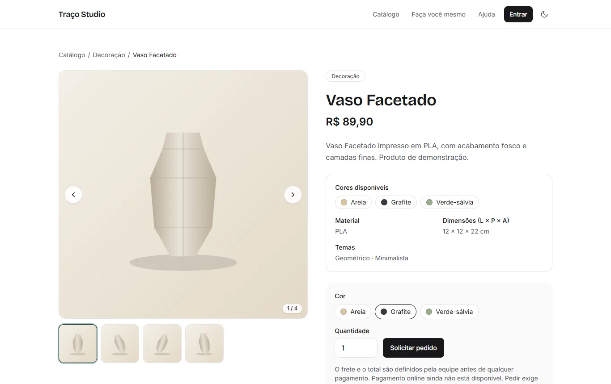 |  |

**Busca tolerante a acentos e tema escuro opcional**

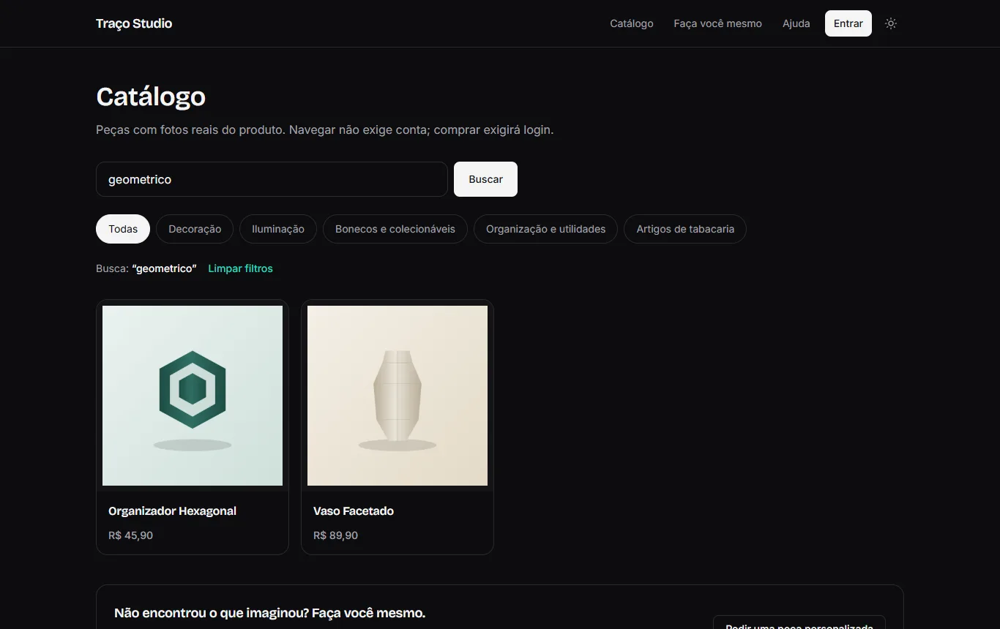

**Revisão do pedido: CEP digitado uma vez, frete "a confirmar pela equipe" e cupom de 5%**

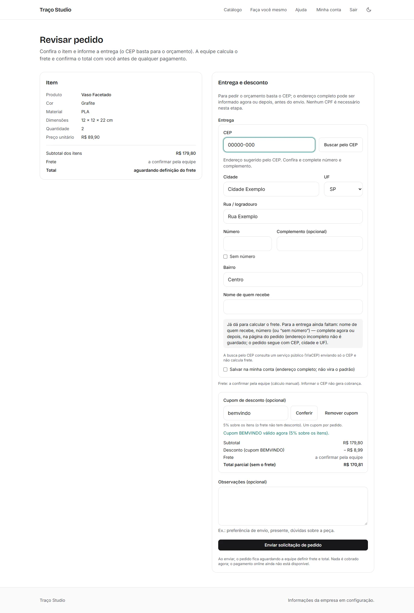

### Pedido personalizado

**"Faça você mesmo": ideia, referências, STL opcional e entrega opcional nesta etapa**

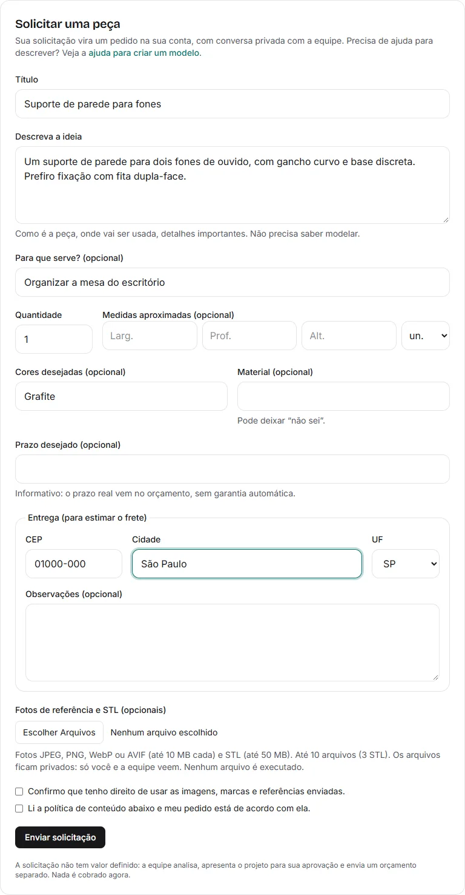

**Acompanhamento: apresentação para aprovação e conversa com a equipe**

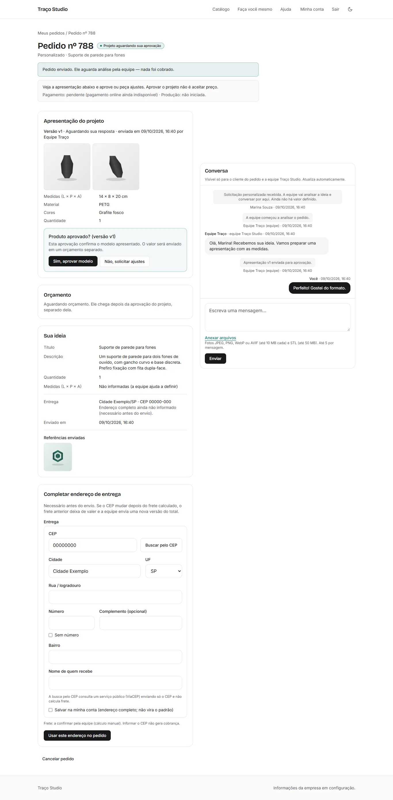

| Orçamento com calculadora interna (equipe) | Orçamento recebido pelo cliente, com PDF da versão |
|---|---|
| 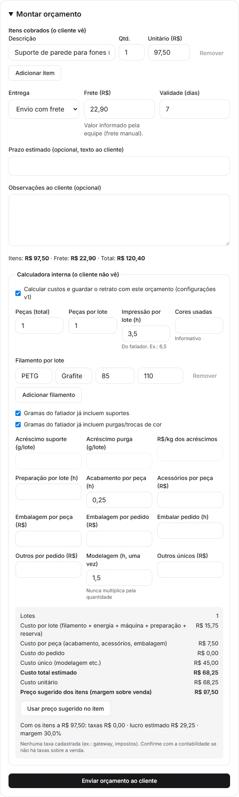 | 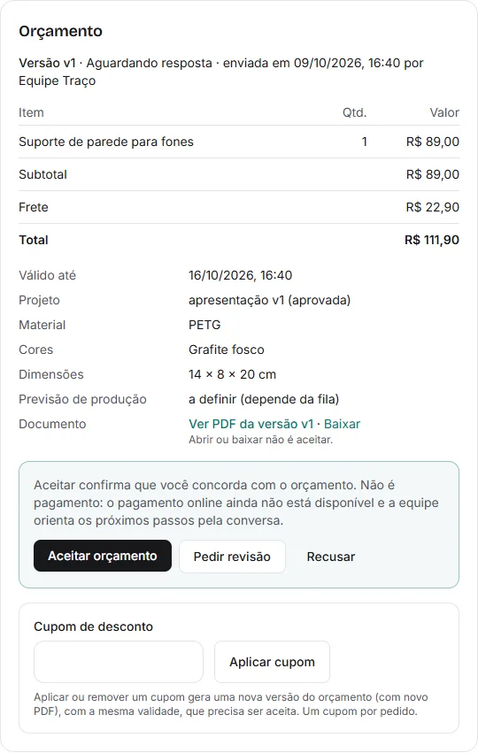 |

**Depois do aceite: aguardando pagamento — sem cobrança simulada**

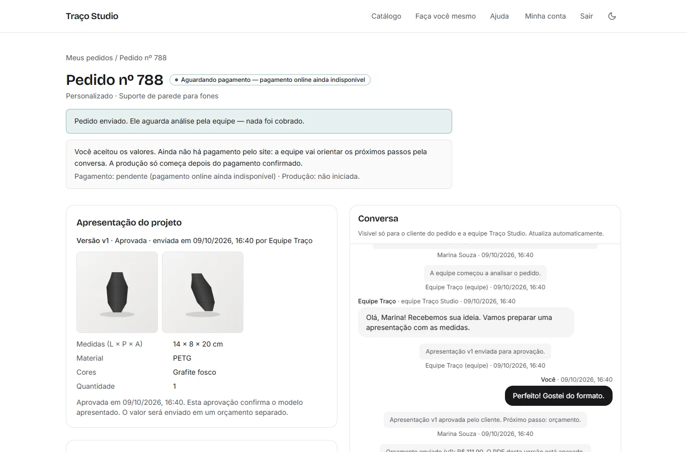

### Equipe

| Caixa de pedidos, com não lidas por pessoa | Custos reutilizáveis (impressora, materiais, parâmetros) |
|---|---|
| 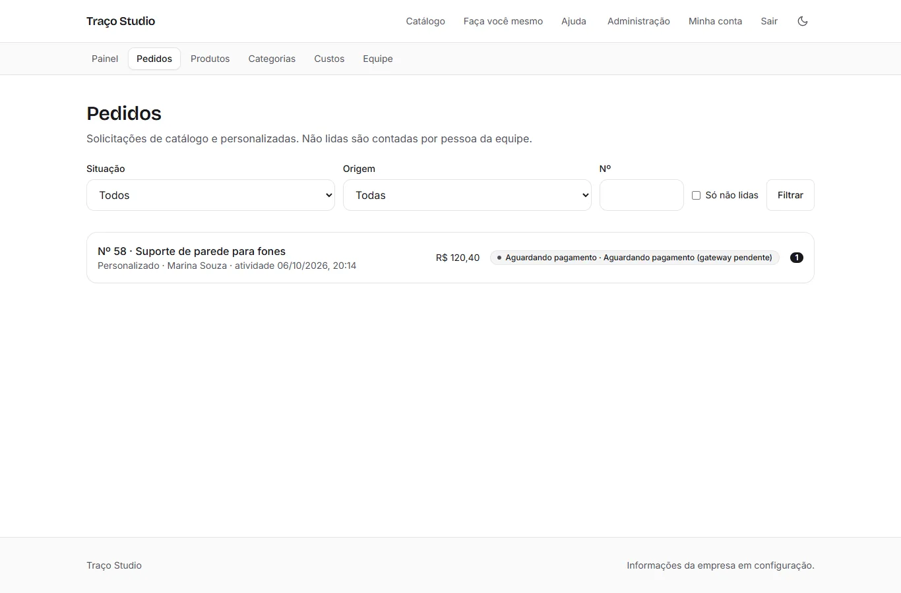 | 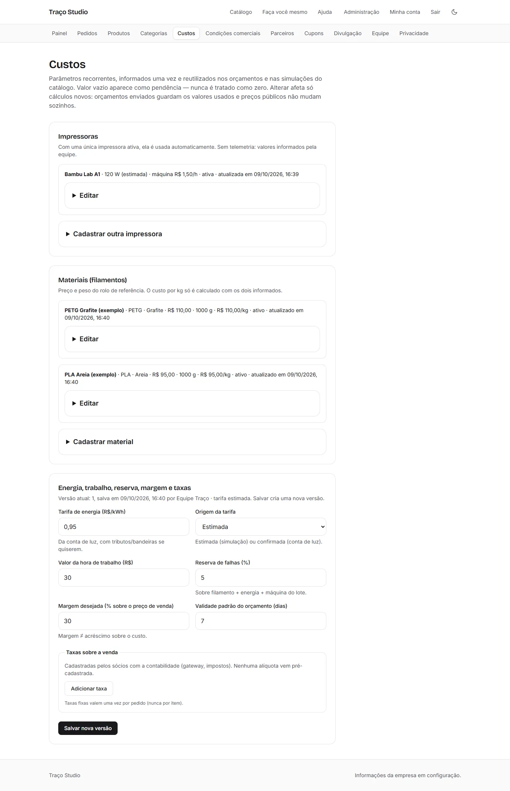 |

### Parceiros que propõem produtos

| Área do parceiro: proposta enviada e simulação | Análise da proposta pela equipe |
|---|---|
| 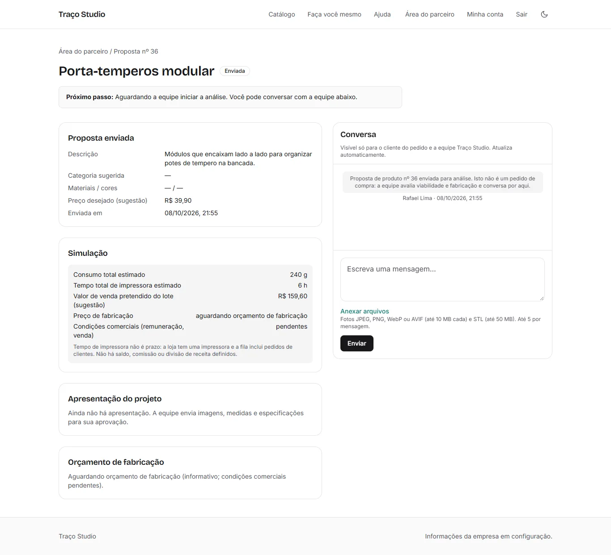 | 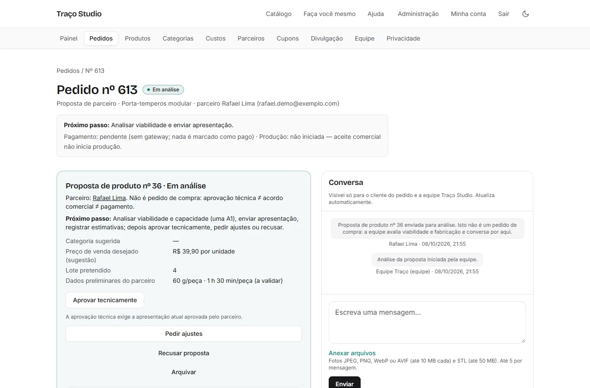 |

**Divulgação: QR Code da loja, marcado como teste enquanto não há domínio público**

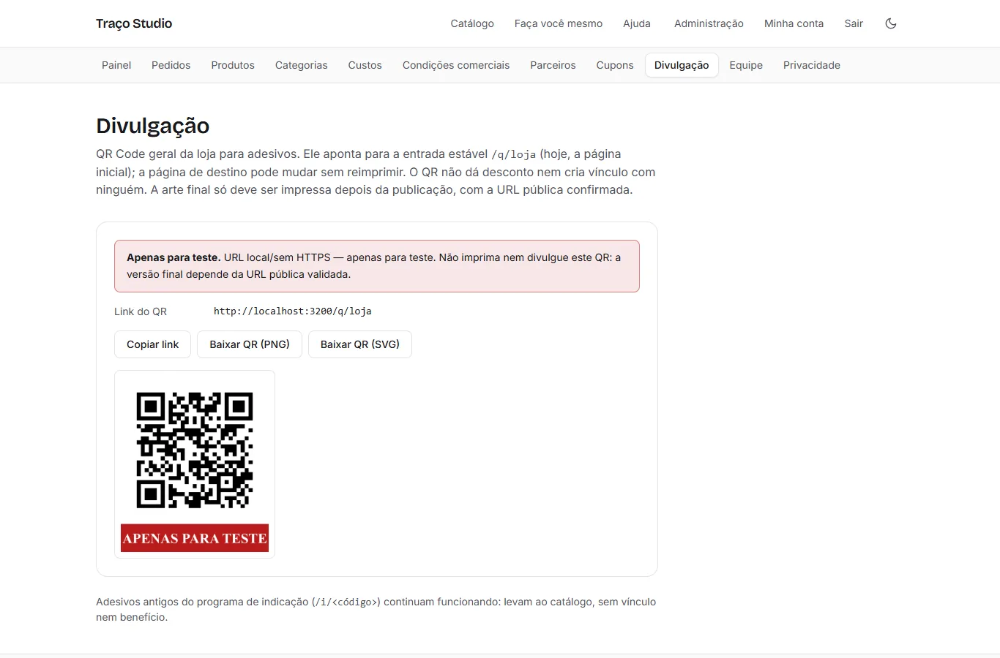

## Funcionalidades implementadas

**Contas e permissões**
- Cadastro com confirmação de email (link de uso único), login, recuperação de senha e "sair de todos os dispositivos".
- Papéis de proprietário, administrador e cliente; acesso administrativo só por convite; permissões verificadas no
  servidor em toda operação; limite de tentativas de login.
- Menus separados para cliente, parceiro e equipe.

**Catálogo**
- Produtos com categorias múltiplas, temas, cores, material e dimensões; rascunhos invisíveis ao público.
- Publicação exige pelo menos **4 fotos reais e distintas**; galeria convencional com ampliação e navegação por teclado.
- Busca sem acentos e tolerante a erros de digitação, filtros compartilháveis por link e "carregar mais".

**Pedidos do catálogo**
- Escolha de cor e quantidade, revisão autenticada e envio protegido contra pedido duplicado.
- O preço é conferido no servidor e o item fica registrado como estava no momento do pedido.
- Frete definido pela equipe; até lá o pedido mostra "a confirmar pela equipe", nunca um valor inventado.

**CEP e endereço unificados**
- O mesmo bloco de endereço no cadastro, em "Minha conta", no pedido de catálogo, no pedido personalizado e na
  complementação posterior.
- O CEP é digitado uma vez: a busca sugere rua, bairro, cidade e UF sem sobrescrever o que a pessoa digitou; se a
  busca falhar, o preenchimento é manual.
- Para pedir o orçamento bastam CEP, cidade e UF; o endereço completo pode vir depois. "Salvar na minha conta" é uma
  escolha explícita, e cada pedido guarda a própria cópia do endereço.
- Trocar o CEP de um pedido com orçamento em aberto faz a equipe recalcular o frete; depois do aceite, só por
  revisão comercial.

**Cupons de 5%**
- Códigos criados pela equipe, com validade opcional; o desconto é sempre de 5% sobre os itens, nunca sobre o frete.
- O cliente confere o cupom antes de enviar o pedido ou o aplica no orçamento, o que gera uma nova versão.
- Nenhum desconto é aplicado automaticamente por acessar um link ou QR Code.

**Pedidos personalizados**
- Descrição da ideia, finalidade, medidas, quantidade e preferências; fotos de referência e arquivo STL opcionais.
- Anexos privados: imagens reprocessadas sem metadados, STL validado como dado (nunca executado), acesso conferido a
  cada download.

**Conversa privada**
- Uma conversa por pedido, com anexos, identificação de quem respondeu (inclusive entre membros da equipe), horário,
  mensagens não lidas por pessoa, histórico paginado, atualização automática e reenvio sem duplicar.
- Avisos por email levam ao pedido na conta autenticada, sem expor o conteúdo da conversa.

**Apresentação e aprovação do projeto**
- A equipe envia imagens, medidas e especificações em versões numeradas.
- O cliente aprova ou pede ajustes; a aprovação vale só para aquela versão e uma nova versão exige nova aprovação.

**Custos reutilizáveis**
- Impressora, materiais (preço e peso do rolo) e parâmetros de energia, trabalho, reserva de falhas e margem são
  cadastrados uma vez e reutilizados nos orçamentos e na simulação de preço dos produtos do catálogo.
- Parâmetros versionados: alterar afeta só cálculos novos. Valor ausente aparece como pendência, nunca como zero.
- O cliente nunca vê custos internos; o preço público de um produto não muda sozinho.

**Orçamentos versionados e PDFs privados**
- Orçamento com validade, frete e total; versões vencidas ou substituídas não podem ser aceitas.
- Cada versão gera um PDF no servidor, anexado à conversa e acessível só ao cliente do pedido e à equipe.
  Abrir ou baixar o PDF não é aceitar.
- Aceite registrado de forma idempotente. **Aceitar não é pagar**: o pedido passa a "aguardando pagamento" e a
  produção não começa automaticamente.

**Parceiros que propõem produtos**
- A equipe cadastra parceiros (nome e email) e os convida a vincular a própria conta; o vínculo exige o mesmo email,
  já confirmado, e não dá acesso administrativo.
- Na área do parceiro: criar proposta (descrição, finalidade, medidas, materiais, cores, fotos de referência e STL
  privados, preço desejado), acompanhar a situação e o próximo passo e conversar com a equipe.
- A equipe analisa, pede ajustes, envia apresentação e um orçamento de fabricação informativo, aprova tecnicamente ou
  recusa com explicação. Mudança depois da aprovação exige nova versão.
- A simulação do parceiro usa só os dados dele; o preço de fabricação aparece apenas quando a equipe envia um
  orçamento. Não há saldo, carteira, comissão ou divisão de receita.
- Uma proposta aprovada pode virar **rascunho de produto** (sem preço e sem fotos), com a publicação bloqueada.

**Divulgação por QR Code**
- QR Code geral da loja para adesivos, apontando para uma entrada estável que permite mudar o destino sem reimprimir.
- Enquanto não houver domínio público confirmado, o QR é marcado como **apenas para teste** e não deve ser impresso.

## Mudança de rumo: de afiliados para parceiros

Uma versão anterior, que não chegou a ser publicada, tinha um programa de indicação: links de afiliados, vínculo de
clientes e comissão. Ele foi substituído por **parceiros que propõem produtos**. O programa de indicação foi
**encerrado**: não há novos links, vínculos ou comissões, e links antigos apenas levam ao catálogo. O histórico
técnico foi preservado no projeto privado.

## Tecnologias

| Camada | Ferramentas |
|---|---|
| Aplicação | Next.js 16 (App Router), React 19, TypeScript 5.9 (modo estrito) |
| Interface | Tailwind CSS 4, fontes Bricolage Grotesque e Inter (licença OFL), tema claro e escuro |
| Dados | PostgreSQL 18 (busca com `pg_trgm` e `unaccent`), Prisma ORM 7 |
| Autenticação | Better Auth |
| Validação e valores | Zod 4, decimal.js (dinheiro em centavos inteiros) |
| Arquivos e documentos | sharp (reprocessamento de imagens), pdf-lib (PDF do orçamento), armazenamento em disco por adaptador |
| Email | fila no banco + worker com Nodemailer (SMTP); Mailpit para captura local |
| Testes | Vitest (unidade e integração com banco de testes isolado) e Playwright (Edge e WebKit) |

## Arquitetura

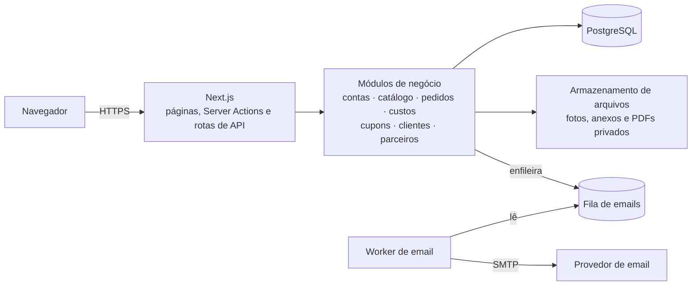

Monólito modular: as rotas só validam a entrada e chamam os módulos, onde ficam as regras (autorização, preços,
versões, idempotência). Operações críticas usam transações e travas no banco.

## Estado atual

| Item | Situação |
|---|---|
| Funcionalidades acima | Implementadas e funcionando em ambiente local |
| Testes automatizados | Unidade, integração (banco de testes isolado) e ponta a ponta no navegador, executados com sucesso na última rodada |
| Validação manual pelos sócios | Em andamento |
| Venda de produtos de parceiros | **Pendente** — a publicação depende de definição comercial (remuneração, autorização de venda, contrato) |
| Pagamento online | **Não implementado** — sem gateway, sem cobrança |
| Saque e repasses | **Não implementados** |
| Hospedagem e domínio | **Não publicados** — arquitetura e procedimento de implantação preparados, aguardando decisão |
| Email transacional real | **Não configurado** — hoje os emails são capturados localmente |
| QR Code de divulgação | **Apenas de teste** (gerado localmente, sem domínio público) |

## Próximas etapas

1. Concluir a validação manual e ajustar o que aparecer.
2. Definir as condições comerciais para produtos de parceiros.
3. Hospedagem, domínio e email transacional real, com verificação em ambiente publicado; QR Code definitivo.
4. Integração com gateway de pagamento, com confirmação verificável pelo servidor.
5. Depois: carrinho e estoque, produção e prazos, envio e rastreio, avaliações.

## Autoria e uso de IA

**Kelvin Simoes** — concepção do produto, definição dos fluxos de compra, personalização, aprovação e orçamento,
regras de negócio e critérios de segurança, decisões de escopo e validação do funcionamento e do visual.

O desenvolvimento contou com **apoio de IA** (assistente de programação), usado para implementar código, testes e
documentação a partir das especificações, decisões e revisões feitas pelo autor. Todo o trabalho passou por
verificação com testes automatizados e validação manual.

## Código-fonte

O código-fonte da aplicação é **privado**. Este repositório contém apenas esta apresentação e as imagens de
demonstração; ele não disponibiliza o software nem concede licença de uso.
